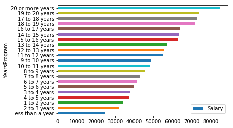
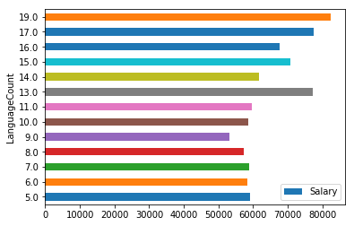

<h2>Objectives:</h2>
Understand the following
<list>
<li>1. Influence of education on salary
<li>2. Relation between years of experience and salary
<li>3. Effect of knowing more than one programming language
</list>


```python
# Read the data from the csv files using Pandas and store them in Pandas DataFrame
import pandas as pd
df = pd.read_csv('survey_results_public.csv')
schema = pd.read_csv('survey_results_schema.csv')
```


```python
df.describe()
```


<div>
<style scoped>
    .dataframe tbody tr th:only-of-type {
        vertical-align: middle;
    }

    .dataframe tbody tr th {
        vertical-align: top;
    }

    .dataframe thead th {
        text-align: right;
    }
</style>
<table border="1" class="dataframe">
  <thead>
    <tr style="text-align: right;">
      <th></th>
      <th>Respondent</th>
      <th>CareerSatisfaction</th>
      <th>JobSatisfaction</th>
      <th>HoursPerWeek</th>
      <th>StackOverflowSatisfaction</th>
      <th>Salary</th>
      <th>ExpectedSalary</th>
    </tr>
  </thead>
  <tbody>
    <tr>
      <th>count</th>
      <td>51392.000000</td>
      <td>42695.000000</td>
      <td>40376.000000</td>
      <td>20600.000000</td>
      <td>36592.000000</td>
      <td>12891.000000</td>
      <td>2566.000000</td>
    </tr>
    <tr>
      <th>mean</th>
      <td>25696.500000</td>
      <td>7.300574</td>
      <td>6.957078</td>
      <td>3.952282</td>
      <td>8.429875</td>
      <td>56298.480641</td>
      <td>33142.220468</td>
    </tr>
    <tr>
      <th>std</th>
      <td>14835.736854</td>
      <td>1.955444</td>
      <td>2.167652</td>
      <td>7.564722</td>
      <td>1.390635</td>
      <td>39880.905277</td>
      <td>30162.988829</td>
    </tr>
    <tr>
      <th>min</th>
      <td>1.000000</td>
      <td>0.000000</td>
      <td>0.000000</td>
      <td>0.000000</td>
      <td>0.000000</td>
      <td>0.000000</td>
      <td>0.000000</td>
    </tr>
    <tr>
      <th>25%</th>
      <td>12848.750000</td>
      <td>6.000000</td>
      <td>6.000000</td>
      <td>1.000000</td>
      <td>8.000000</td>
      <td>26440.371839</td>
      <td>4490.492484</td>
    </tr>
    <tr>
      <th>50%</th>
      <td>25696.500000</td>
      <td>8.000000</td>
      <td>7.000000</td>
      <td>1.000000</td>
      <td>9.000000</td>
      <td>50000.000000</td>
      <td>29364.263691</td>
    </tr>
    <tr>
      <th>75%</th>
      <td>38544.250000</td>
      <td>9.000000</td>
      <td>8.000000</td>
      <td>4.000000</td>
      <td>10.000000</td>
      <td>80000.000000</td>
      <td>50403.225806</td>
    </tr>
    <tr>
      <th>max</th>
      <td>51392.000000</td>
      <td>10.000000</td>
      <td>10.000000</td>
      <td>40.000000</td>
      <td>10.000000</td>
      <td>197000.000000</td>
      <td>187500.000000</td>
    </tr>
  </tbody>
</table>
</div>


```python
# Define functions
def get_question(column_name, schema=schema):
    """
    SUMMARY: 
            Returns the question for the column
    INPUT:
            column_name - string - name of the column eg.'Salary'
            schema - Pandas DataFrame - DataFrame of Schema
    OUTPUT: 
            desc - string - the description of the column
    """
    desc = list(schema[schema['Column'] == column_name]['Question'])[0]
    return desc

def group_results(df, column_name):
    """ 
    SUMMARY: 
            Returns grouped data
    
    INPUT: 
            df - Panda DataFrame
            column_name - string - name of the column eg.'Salary'
  
    OUTPUT: 
            grouped_df - Panda DataFrame - grouped by column_name with mean
    """
    grouped_df = df.groupby([column_name]).mean().reset_index()
    return grouped_df

def plot_graph(df, x_data, y_data):
    """ 
    SUMMARY: 
            Plot the Panda DataFrame.
    
    INPUT: 
            df - Panda DataFrame
            x_data - string - name of the column eg.'FormalEducation' for x-axis
            y_data - string - name of the column eg.'Salary' for y-axis
  
    OUTPUT: 
            Display Graph
    """
    ax = df.plot.barh(x=x_data, y=y_data, rot=0)
    return ax

def count_language(df):
    """     
        SUMMARY: 
            Count the languages.
            
        INPUT: 
            df - Panda DataFrame
  
        OUTPUT: 
            df_LanguageCount - Panda DataFrame - GroupBy object with mean 
            after counting languages known
    """
    df_LanguageCount = df
    # Counting number of languages
    df_LanguageCount['LanguageCount'] = df_LanguageCount['HaveWorkedLanguage'].str.count(';') + 1
    # Dropping NaN in LanguageCount and Salary - as they skew the tesults
    df_LanguageCount.dropna(subset=['LanguageCount','Salary'], inplace=True)
    df_LanguageCount.reset_index(drop=True, inplace=True)
    # Grouping Salary according to number of languages
    df_LanguageCount = df.groupby(['LanguageCount']).mean().reset_index()
    # Fitlering Outliers - as they skew the tesults
    LanguageCountQuantile = df_LanguageCount["LanguageCount"].quantile(0.2)
    SalaryQuantile = df_LanguageCount["Salary"].quantile(0.2)
    df_LanguageCount = df_LanguageCount[df_LanguageCount["LanguageCount"] > LanguageCountQuantile]
    df_LanguageCount = df_LanguageCount[df_LanguageCount["Salary"] > SalaryQuantile]
    return df_LanguageCount
```


```python
print(get_question('Salary'))
```

    What is your current annual base salary, before taxes, and excluding bonuses, grants, or other compensation?
    

<h2>1. Formal Education - Influence of education on salary</h2>


```python
print(get_question('FormalEducation'))
```

    Which of the following best describes the highest level of formal education that you've completed?
    


```python
df_FormalEducation = group_results(df, 'FormalEducation')
df_FormalEducation[['FormalEducation', 'Salary']].sort_values(by='Salary', ascending=False)

```


<div>
<style scoped>
    .dataframe tbody tr th:only-of-type {
        vertical-align: middle;
    }

    .dataframe tbody tr th {
        vertical-align: top;
    }

    .dataframe thead th {
        text-align: right;
    }
</style>
<table border="1" class="dataframe">
  <thead>
    <tr style="text-align: right;">
      <th></th>
      <th>FormalEducation</th>
      <th>Salary</th>
    </tr>
  </thead>
  <tbody>
    <tr>
      <th>1</th>
      <td>Doctoral degree</td>
      <td>78527.933053</td>
    </tr>
    <tr>
      <th>5</th>
      <td>Primary/elementary school</td>
      <td>62677.337356</td>
    </tr>
    <tr>
      <th>4</th>
      <td>Master's degree</td>
      <td>58250.838766</td>
    </tr>
    <tr>
      <th>0</th>
      <td>Bachelor's degree</td>
      <td>56914.358553</td>
    </tr>
    <tr>
      <th>8</th>
      <td>Some college/university study without earning ...</td>
      <td>55912.810459</td>
    </tr>
    <tr>
      <th>2</th>
      <td>I never completed any formal education</td>
      <td>44430.660621</td>
    </tr>
    <tr>
      <th>7</th>
      <td>Secondary school</td>
      <td>40395.148419</td>
    </tr>
    <tr>
      <th>6</th>
      <td>Professional degree</td>
      <td>39503.658863</td>
    </tr>
    <tr>
      <th>3</th>
      <td>I prefer not to answer</td>
      <td>38284.836141</td>
    </tr>
  </tbody>
</table>
</div>


```python
df_FormalEducation = df_FormalEducation[['FormalEducation', 'Salary']].sort_values(by='Salary', ascending=True)
FormalEducation_vs_Salary = plot_graph(df_FormalEducation, 'FormalEducation', 'Salary')
```

<b>Conclusion:</b><br>
If we don't consider Primary/elementary school as formal education, higher the formal education, higher is the salary.

<h2>2. Experience - Relation between years of experience and salary</h2>


```python
print(get_question('YearsProgram'))
```

    How long has it been since you first learned how to program?
    


```python
df_YearsProgram = group_results(df, 'YearsProgram')
df_YearsProgram[['YearsProgram', 'Salary']].sort_values(by='Salary', ascending=False)
```


<div>
<style scoped>
    .dataframe tbody tr th:only-of-type {
        vertical-align: middle;
    }

    .dataframe tbody tr th {
        vertical-align: top;
    }

    .dataframe thead th {
        text-align: right;
    }
</style>
<table border="1" class="dataframe">
  <thead>
    <tr style="text-align: right;">
      <th></th>
      <th>YearsProgram</th>
      <th>Salary</th>
    </tr>
  </thead>
  <tbody>
    <tr>
      <th>12</th>
      <td>20 or more years</td>
      <td>84564.967771</td>
    </tr>
    <tr>
      <th>10</th>
      <td>19 to 20 years</td>
      <td>73926.990204</td>
    </tr>
    <tr>
      <th>8</th>
      <td>17 to 18 years</td>
      <td>73085.731295</td>
    </tr>
    <tr>
      <th>9</th>
      <td>18 to 19 years</td>
      <td>71599.061950</td>
    </tr>
    <tr>
      <th>7</th>
      <td>16 to 17 years</td>
      <td>63898.935647</td>
    </tr>
    <tr>
      <th>5</th>
      <td>14 to 15 years</td>
      <td>63487.522662</td>
    </tr>
    <tr>
      <th>6</th>
      <td>15 to 16 years</td>
      <td>62791.031631</td>
    </tr>
    <tr>
      <th>4</th>
      <td>13 to 14 years</td>
      <td>57149.324680</td>
    </tr>
    <tr>
      <th>3</th>
      <td>12 to 13 years</td>
      <td>55753.347727</td>
    </tr>
    <tr>
      <th>2</th>
      <td>11 to 12 years</td>
      <td>54866.916054</td>
    </tr>
    <tr>
      <th>19</th>
      <td>9 to 10 years</td>
      <td>48603.051609</td>
    </tr>
    <tr>
      <th>1</th>
      <td>10 to 11 years</td>
      <td>48056.752718</td>
    </tr>
    <tr>
      <th>18</th>
      <td>8 to 9 years</td>
      <td>45788.562715</td>
    </tr>
    <tr>
      <th>17</th>
      <td>7 to 8 years</td>
      <td>42798.492890</td>
    </tr>
    <tr>
      <th>16</th>
      <td>6 to 7 years</td>
      <td>41112.825421</td>
    </tr>
    <tr>
      <th>15</th>
      <td>5 to 6 years</td>
      <td>39585.967627</td>
    </tr>
    <tr>
      <th>13</th>
      <td>3 to 4 years</td>
      <td>37686.091623</td>
    </tr>
    <tr>
      <th>14</th>
      <td>4 to 5 years</td>
      <td>37220.203860</td>
    </tr>
    <tr>
      <th>0</th>
      <td>1 to 2 years</td>
      <td>33952.955892</td>
    </tr>
    <tr>
      <th>11</th>
      <td>2 to 3 years</td>
      <td>31997.480185</td>
    </tr>
    <tr>
      <th>20</th>
      <td>Less than a year</td>
      <td>24673.256855</td>
    </tr>
  </tbody>
</table>
</div>


```python
df_YearsProgram = df_YearsProgram[['YearsProgram', 'Salary']].sort_values(by='Salary', ascending=True)
YearsProgram_vs_Salary = plot_graph(df_YearsProgram, 'YearsProgram', 'Salary')
```





<b>Conclusion:</b><br>
Higher the experience, higher is the salary.

<h2>3. Programming Languages Count - Effect of knowing more than one programming language</h2>


```python
print(get_question('HaveWorkedLanguage'))
```

    Which of the following languages have you done extensive development work in over the past year, and which do you want to work in over the next year?
    


```python
df_LanguageCount = count_language(df)
df_LanguageCount[['LanguageCount', 'Salary']].sort_values(by='LanguageCount', ascending=False)
```


<div>
<style scoped>
    .dataframe tbody tr th:only-of-type {
        vertical-align: middle;
    }

    .dataframe tbody tr th {
        vertical-align: top;
    }

    .dataframe thead th {
        text-align: right;
    }
</style>
<table border="1" class="dataframe">
  <thead>
    <tr style="text-align: right;">
      <th></th>
      <th>LanguageCount</th>
      <th>Salary</th>
    </tr>
  </thead>
  <tbody>
    <tr>
      <th>18</th>
      <td>19.0</td>
      <td>82500.000000</td>
    </tr>
    <tr>
      <th>16</th>
      <td>17.0</td>
      <td>77500.000000</td>
    </tr>
    <tr>
      <th>15</th>
      <td>16.0</td>
      <td>67597.634409</td>
    </tr>
    <tr>
      <th>14</th>
      <td>15.0</td>
      <td>70659.319839</td>
    </tr>
    <tr>
      <th>13</th>
      <td>14.0</td>
      <td>61746.782327</td>
    </tr>
    <tr>
      <th>12</th>
      <td>13.0</td>
      <td>77245.873750</td>
    </tr>
    <tr>
      <th>10</th>
      <td>11.0</td>
      <td>59553.938834</td>
    </tr>
    <tr>
      <th>9</th>
      <td>10.0</td>
      <td>58741.498670</td>
    </tr>
    <tr>
      <th>8</th>
      <td>9.0</td>
      <td>53301.021354</td>
    </tr>
    <tr>
      <th>7</th>
      <td>8.0</td>
      <td>57447.874539</td>
    </tr>
    <tr>
      <th>6</th>
      <td>7.0</td>
      <td>58763.422530</td>
    </tr>
    <tr>
      <th>5</th>
      <td>6.0</td>
      <td>58405.710495</td>
    </tr>
    <tr>
      <th>4</th>
      <td>5.0</td>
      <td>59163.122613</td>
    </tr>
  </tbody>
</table>
</div>


```python
df_LanguageCount = df_LanguageCount[['LanguageCount', 'Salary']].sort_values(by='LanguageCount', ascending=True)
LanguageCount_vs_Salary = plot_graph(df_LanguageCount, 'LanguageCount', 'Salary')
```





<b>Conclusion:</b><br>
Knowing lot of programming languages does not necessarily increase the salary.


```python

```
